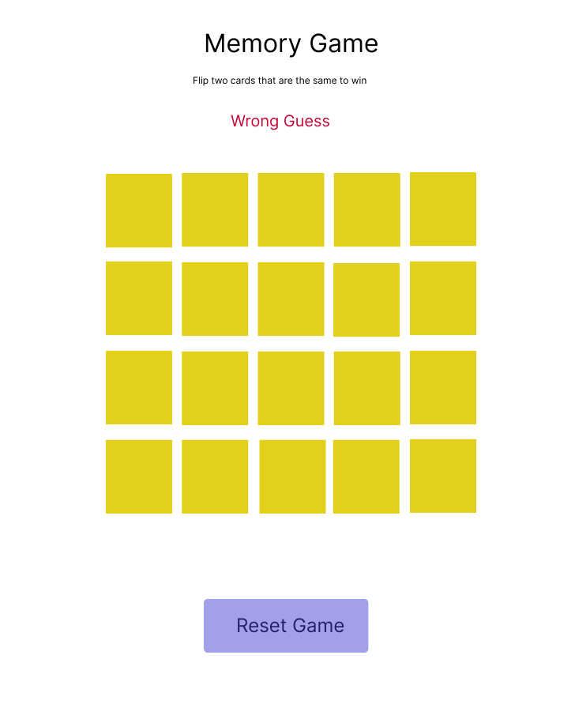
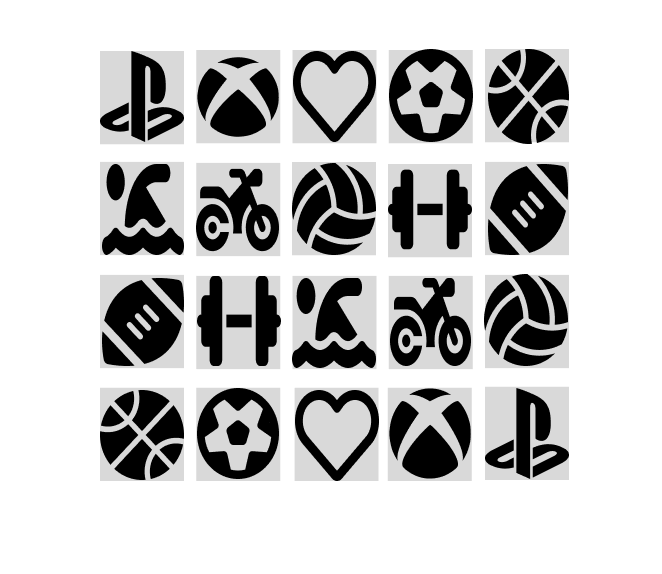

# Memory Matching Game

## Description

This is a memory matching game implemented using HTML, CSS, and JavaScript. Players need to find pairs of matching cards by flipping them over. The game has Font Awesome icons for card symbols and Figma for the design inspiration and wireframing.

## Gameplay

The game starts with a grid of facedown cards. Clicking on a card flips it over to reveal the symbol underneath. Players need to remember the positions of the symbols and find matching pairs by flipping over two cards at a time. If the symbols match, the cards remain face-up. If not, the cards are flipped back face-down, and the player continues until all pairs are found.

## Sudo code

### Define constant variables for the player and cards:
- Player: a string representing the name of the player
- Cards: an array containing the card objects with image URLs and match status

### State variables:
- board: Represents the current state of the game board.
- firstCard: Holds the reference to the first card clicked by the player.
- secondCard: Holds the reference to the second card clicked by the player.
- ignoreClick: A boolean flag to prevent multiple card clicks during certain game states.
- gameOver: Indicates whether the game is over or not.
- timer: Holds the reference to the timer interval.

### Cache elements:
- Cache the board element.
- Get the HTML element with the id "message" to display messages to the user.
- Get the HTML element for the timer using its ID.
- Cache the reset button.

### Event listeners:
- Add an event listener to the board element to listen for clicks.
- Add an event listener to the reset button to reset the board.

### Functions:
- Initialize the board: Create a function to initialize the game board. Call this function to start the game.
- Shuffle cards: Create a function to shuffle the cards.
- Handle click: Create a function to handle a click on a card. When the user clicks on a card, it flips over and displays its icon.
- Check for winner: Create a function to check if the player has won the game.
- Render message: Create a function to render messages to the user if they win or lose.
- Render controls: Create a function to render controls based on the game state (e.g., reset button visibility).
- Render: Create a function to render the game board and controls.

## How to Play

1. Click on a card to flip it over.
2. Click on another card to see if it matches the first one.
3. Keep flipping cards until all pairs are found.

