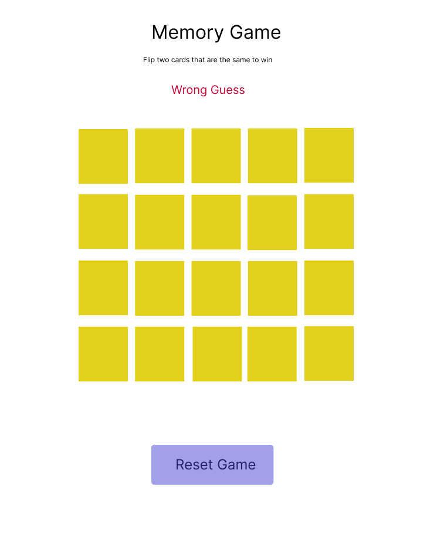
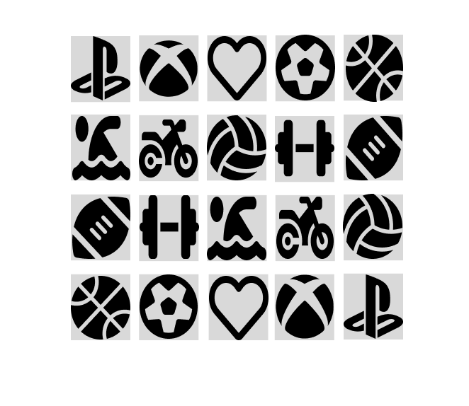

# Memory Matching Game

[]

## Description

This is a memory matching game implemented using HTML, CSS, and JavaScript. Players need to find pairs of matching cards by flipping them over. The game has Font Awesome icons for card symbols and Figma for the design inspiration and wireframing.

## Gameplay

The game starts with a grid of facedown cards. Clicking on a card flips it over to reveal the symbol underneath. Players need to remember the positions of the symbols and find matching pairs by flipping over two cards at a time. If the symbols match, the cards remain face-up. If not, the cards are flipped back face-down, and the player continues until all pairs are found.

## Sudo code

# Define constant variable for the player and card.
    -  Player: a string representing the name of the player
    -  Card: an array containing the icons

# Cache The board element.
    - Get the HTML element with id "message" to display messages to the user
    - Get the HTMl element for the Timer  using its ID
 

# event listener.
    - add event listener to the board element to listen for clicks
    - add event listener to the reset button to reset the board

# functions
    - Create function to initialize the board, Call this function to initialize the  game.
    - Create a function to shuffle the cards.
    - Create a function to handle a click on a card, when user clicks on the card it flips over  and displays its icon. 
    -Create a function to check for winner.
    -Create a function to render message to the user if they  win or lose.

## How to Play

1. Click on a card to flip it over.
2. Click on another card to see if it matches the first one.
3. Keep flipping cards until all pairs are found.

